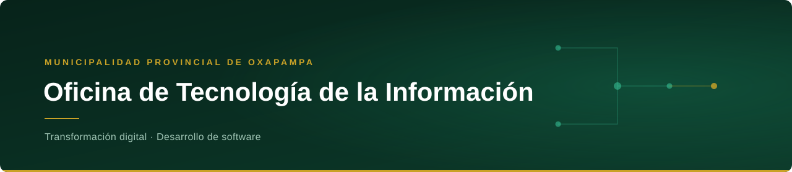
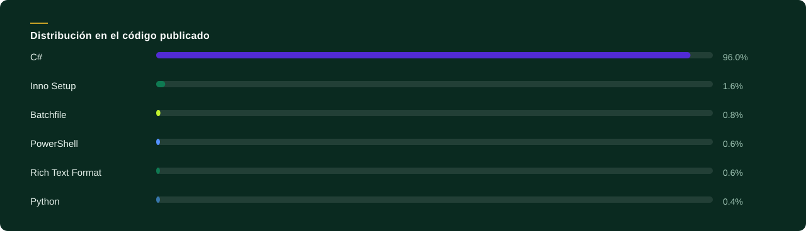

  

 

  Soluciones digitales propias para modernizar la gestión municipal.

 

## Tecnologías

 

  

 

## Proyectos

  Revisión del catálogo · septiembre de 2026

### En desarrollo y uso institucional

<table>
  <tr>
    <td width="80" align="center" valign="middle">
      
    </td>
    <td valign="top">
      <h3><a href="https://github.com/Informatica-Oxapampa/Generador-de-Anexos">Generador de Anexos</a></h3>
      
Aplicativo para agilizar la elaboración y generación de Términos de Referencia (TDR) y Anexos de la entidad.

      
<strong>C#</strong> · Actualizado el 02/09/2026

    </td>
  </tr>
</table>

   
  Oficina de Tecnología de la Información · Municipalidad Provincial de Oxapampa

